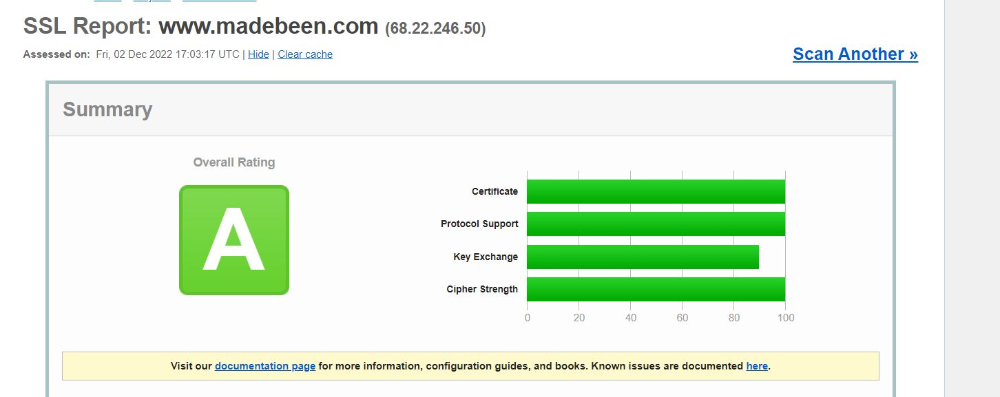
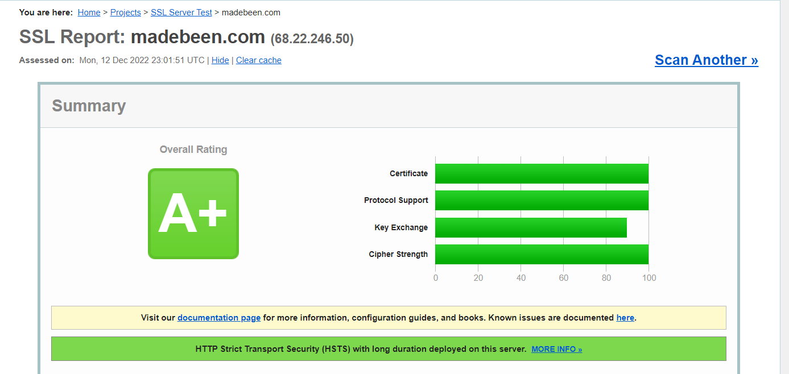

**A SSL Labs Report using TLS1.2**

```
root@(apm1)(cfg-sync Standalone)(Active)(/Common)(tmos)# list ltm profile client-ssl SSL_Qualys_A
ltm profile client-ssl SSL_Qualys_A {
    app-service none
    cert test_2022
    cert-key-chain {
        test_SectigoRSADomainValidationSecureServerCA_0 {
            cert test_2022
            chain SectigoRSADomainValidationSecureServerCA
            key test_2022
        }
    }
    chain SectigoRSADomainValidationSecureServerCA
    cipher-group none
    ciphers ECDHE-RSA-AES256-GCM-SHA384:!ECDHE+AES:!ECDHE+3DES:!RSA+3DES:!TLSv1_1:!TLSv1:!SSLv3:!MD5:!EXPORT:!RC4
    defaults-from clientssl
    inherit-ca-certkeychain true
    inherit-certkeychain false
    key test_2022
    passphrase none
}
```

**A+ SSL Labs Report using TLS1.2**

```
root@(apm1)(cfg-sync Standalone)(Active)(/Common)(tmos)# list ltm profile client-ssl SSL_Qualys_A
ltm profile client-ssl SSL_Qualys_A {
    app-service none
    cert test_2022
    cert-key-chain {
        test_SectigoRSADomainValidationSecureServerCA_0 {
            cert test_2022
            chain SectigoRSADomainValidationSecureServerCA
            key test_2022
        }
    }
    chain SectigoRSADomainValidationSecureServerCA
    cipher-group none
    ciphers ECDHE-RSA-AES256-GCM-SHA384:!ECDHE+AES:!ECDHE+3DES:!RSA+3DES:!TLSv1_1:!TLSv1:!SSLv3:!MD5:!EXPORT:!RC4
    defaults-from clientssl
    inherit-ca-certkeychain true
    inherit-certkeychain false
    key test_2022
    passphrase none
}
```
HTTP profile using HSTS (enabled)
```
root@(apm1)(cfg-sync Standalone)(Active)(/Common)(tmos)# list ltm profile http http_XFF
ltm profile http http_XFF {
  app-service none
  defaults-from http
  hsts {
    include-subdomains enabled
    maximum-age 15552001
    mode enabled
  }
  insert-xforwarded-for enabled
  proxy-type reverse
  response-chunking rechunk
}
```

**A+ SSL Labs Report using TLS1.3**

For TLS1.3 please note that f5 has changed its approach now. Administrators need to use cipher rules in combination with cipher groups in order to hard code the desired cipher, hashes, exchange keys combos, etc. 
root@(apm1)(cfg-sync Standalone)(Active)(/Common)(tmos)# list ltm cipher group Qualys-SSL-A all-properties
```
ltm cipher group Qualys-SSL-A {
    allow {
        SSL-Labs-A { }
    }
    app-service none
    description none
    exclude none
    ordering default
    partition Common
    require none
}
```
```
root@(apm1)(cfg-sync Standalone)(Active)(/Common)(tmos)# list ltm cipher rule SSL-Labs-A all-properties
ltm cipher rule SSL-Labs-A {
    app-service none
    cipher TLS13-CHACHA20-POLY1305-SHA256:TLS13-AES256-GCM-SHA384:TLS13-AES128-GCM-SHA256:ECDHE-RSA-AES256-GCM-SHA384:ECDHE-RSA-AES128-GCM-SHA256:!DES:!3DES:!RC4:!MD5:!EXPORT
    description none
    dh-groups DEFAULT
    partition Common
    signature-algorithms DEFAULT
}
```
