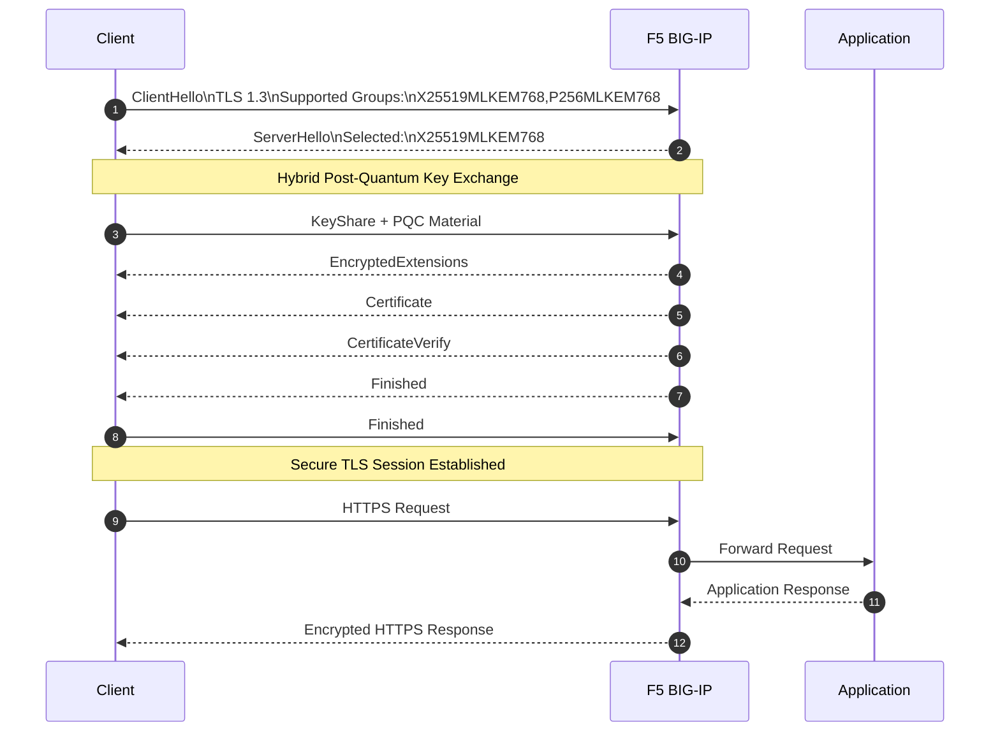
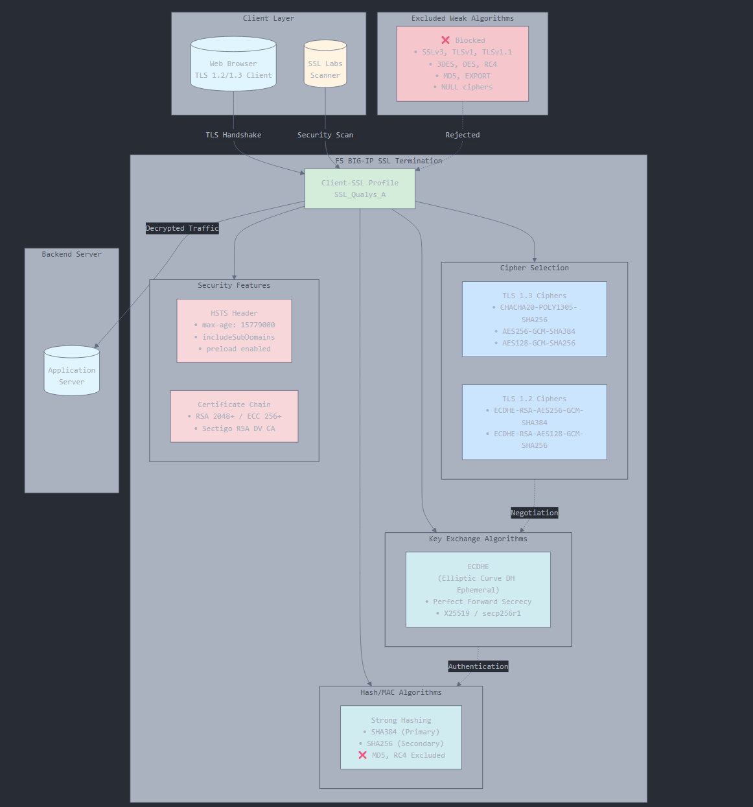
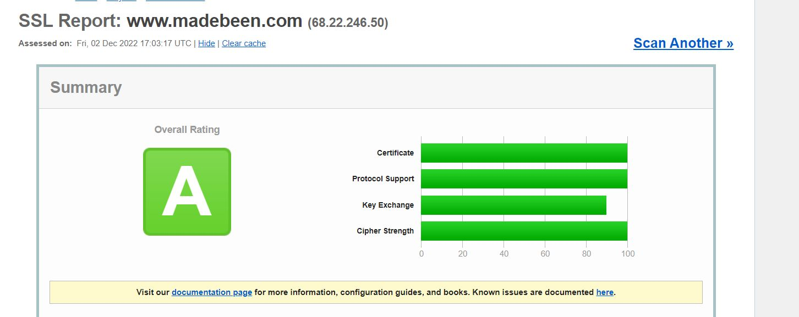
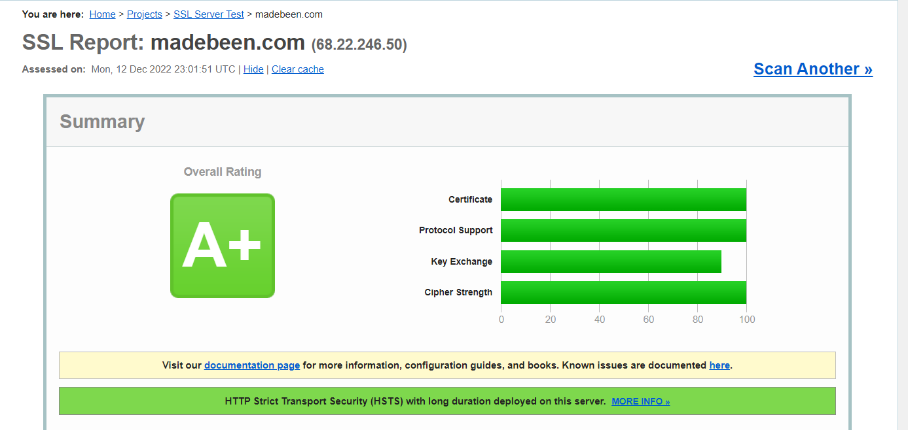

## Packet-Level TLS Handshake (TLS 1.3 + PQC)

Visualizing the exact TLS negotiation path for TLS 1.3 with Hybrid Post-Quantum Cryptography on F5 BIG-IP.

## TLS Negotiation Flow (TLS 1.3 + PQC Hybrid Key Exchange)


```mermaid
sequenceDiagram
    autonumber

    participant C as Client
    participant F as F5 BIG-IP
    participant A as Application

    C->>F: ClientHello\nTLS 1.3\nSupported Groups:\nX25519MLKEM768,P256MLKEM768

    F-->>C: ServerHello\nSelected:\nX25519MLKEM768

    Note over C,F: Hybrid Post-Quantum Key Exchange

    C->>F: KeyShare + PQC Material

    F-->>C: EncryptedExtensions

    F-->>C: Certificate

    F-->>C: CertificateVerify

    F-->>C: Finished

    C->>F: Finished

    Note over C,F: Secure TLS Session Established

    C->>F: HTTPS Request

    F->>A: Forward Request

    A-->>F: Application Response

    F-->>C: Encrypted HTTPS Response
```

---

### TLS Handshake Sequence (Packet Level)

```mermaid
sequenceDiagram
    autonumber

    participant Client
    participant BIGIP as F5 BIG-IP
    participant App

    Note over Client,BIGIP: TCP 3-Way Handshake

    Client->>BIGIP: SYN
    BIGIP-->>Client: SYN-ACK
    Client->>BIGIP: ACK

    Note over Client,BIGIP: TLS 1.3 Negotiation Begins

    Client->>BIGIP: ClientHello
    Note right of Client:
      TLS 1.3
      Cipher Suites
      Supported Groups
      X25519MLKEM768
      P256MLKEM768

    BIGIP-->>Client: ServerHello
    Note left of BIGIP:
      Selected Group:
      X25519MLKEM768

    BIGIP-->>Client: EncryptedExtensions

    BIGIP-->>Client: Certificate

    BIGIP-->>Client: CertificateVerify

    BIGIP-->>Client: Finished

    Client->>BIGIP: Finished

    Note over Client,BIGIP:
      Encrypted Session Established

    Client->>BIGIP: HTTPS Request

    BIGIP->>App: HTTP Forward

    App-->>BIGIP: Application Response

    BIGIP-->>Client: TLS Encrypted Response
```

---

## TLS Packet Mapping

| Packet              | Direction       | Purpose                    |
| ------------------- | --------------- | -------------------------- |
| SYN                 | Client → BIG-IP | TCP Session Start          |
| SYN-ACK             | BIG-IP → Client | TCP Acknowledgement        |
| ClientHello         | Client → BIG-IP | Advertise TLS + PQC Groups |
| ServerHello         | BIG-IP → Client | Select Cipher + KEM        |
| EncryptedExtensions | BIG-IP → Client | TLS Negotiation Parameters |
| Certificate         | BIG-IP → Client | Identity Validation        |
| Finished            | Both Directions | Handshake Complete         |
| Application Data    | Bidirectional   | HTTPS Traffic              |

---

## Capture Handshake with tcpdump

Capture TLS traffic:

```bash
tcpdump -nn -s0 -i 0.0:nnn port 443 -w tls-pqc.pcap
```

Inspect handshake:

```bash
tcpdump -r tls-pqc.pcap
```

Extract TLS messages:

```bash
tshark \
-r tls-pqc.pcap \
-Y tls
```

---

## Validate PQC Negotiation

OpenSSL example:

```bash
openssl s_client \
-connect www.madebeen.com:443 \
-tls1_3 \
-groups X25519MLKEM768
```

Expected output:

```text
TLSv1.3
Server Temp Key:
X25519MLKEM768
```

---

## BIG-IP Verification

View cipher rules:

```bash
tmsh list ltm cipher rule
```

Inspect PQC configuration:

```bash
tmsh list ltm cipher rule PQC all-properties
```

Inspect SSL profile:

```bash
tmsh list ltm profile client-ssl
```

---

## Expected Result

✅ SSL Labs A+
✅ TLS 1.3 Enabled
✅ Hybrid PQC Negotiated
✅ HSTS Enabled
✅ Forward Secrecy Enabled
✅ Modern Cipher Suites Only
The diagram below visualizes how the components interact within the F5 BIG-IP SSL termination layer, showing the flow from client connections through cipher negotiation, key exchange, and hash verification to the backend servers, while explicitly showing which weak algorithms are blocked.

**Key Components:**

**Cipher Selection** - TLS 1.3 and 1.2 approved cipher suites <br>
**Key Exchange** - ECDHE with **Perfect Forward Secrecy** <br>
**Hash Algorithms** - SHA256/SHA384 (strong hashing only) <br>
**Security Headers** - HSTS  configuration <br>
**SSL Labs Grading** - Scanner integration point <br>




**A SSL Labs Report using TLS1.2**

```
root@(apm1)(cfg-sync Standalone)(Active)(/Common)(tmos)# list ltm profile client-ssl SSL_Qualys_A
ltm profile client-ssl SSL_Qualys_A {
    app-service none
    cert test_2022
    cert-key-chain {
        test_SectigoRSADomainValidationSecureServerCA_0 {
            cert test_2022
            chain SectigoRSADomainValidationSecureServerCA
            key test_2022
        }
    }
    chain SectigoRSADomainValidationSecureServerCA
    cipher-group none
    ciphers ECDHE-RSA-AES256-GCM-SHA384:!ECDHE+AES:!ECDHE+3DES:!RSA+3DES:!TLSv1_1:!TLSv1:!SSLv3:!MD5:!EXPORT:!RC4
    defaults-from clientssl
    inherit-ca-certkeychain true
    inherit-certkeychain false
    key test_2022
    passphrase none
}
```

**A+ SSL Labs Report using TLS1.2**

```
root@(apm1)(cfg-sync Standalone)(Active)(/Common)(tmos)# list ltm profile client-ssl SSL_Qualys_A
ltm profile client-ssl SSL_Qualys_A {
    app-service none
    cert test_2022
    cert-key-chain {
        test_SectigoRSADomainValidationSecureServerCA_0 {
            cert test_2022
            chain SectigoRSADomainValidationSecureServerCA
            key test_2022
        }
    }
    chain SectigoRSADomainValidationSecureServerCA
    cipher-group none
    ciphers ECDHE-RSA-AES256-GCM-SHA384:!ECDHE+AES:!ECDHE+3DES:!RSA+3DES:!TLSv1_1:!TLSv1:!SSLv3:!MD5:!EXPORT:!RC4
    defaults-from clientssl
    inherit-ca-certkeychain true
    inherit-certkeychain false
    key test_2022
    passphrase none
}
```
HTTP profile using HSTS (enabled)
```
root@(apm1)(cfg-sync Standalone)(Active)(/Common)(tmos)# list ltm profile http http_XFF
ltm profile http http_XFF {
  app-service none
  defaults-from http
  hsts {
    include-subdomains enabled
    maximum-age 15552001
    mode enabled
  }
  insert-xforwarded-for enabled
  proxy-type reverse
  response-chunking rechunk
}
```

**A+ SSL Labs Report using TLS1.3**

For TLS1.3 please note that f5 has changed its approach now. Administrators need to use cipher rules in combination with cipher groups in order to hard code the desired cipher, hashes, exchange keys combos, etc. 
```
root@(apm1)(cfg-sync Standalone)(Active)(/Common)(tmos)# list ltm cipher group Qualys-SSL-A all-properties
ltm cipher group Qualys-SSL-A {
    allow {
        SSL-Labs-A { }
    }
    app-service none
    description none
    exclude none
    ordering default
    partition Common
    require none
}
```
```
root@(apm1)(cfg-sync Standalone)(Active)(/Common)(tmos)# list ltm cipher rule SSL-Labs-A all-properties
ltm cipher rule SSL-Labs-A {
    app-service none
    cipher TLS13-CHACHA20-POLY1305-SHA256:TLS13-AES256-GCM-SHA384:TLS13-AES128-GCM-SHA256:ECDHE-RSA-AES256-GCM-SHA384:ECDHE-RSA-AES128-GCM-SHA256:!DES:!3DES:!RC4:!MD5:!EXPORT
    description none
    dh-groups DEFAULT
    partition Common
    signature-algorithms DEFAULT
}
```
```
root@(apm1)(cfg-sync Standalone)(Active)(/Common)(tmos)# list ltm profile http http_XFF all-properties
ltm profile http http_XFF {
    accept-xff disabled
    app-service none
    basic-auth-realm none
    defaults-from http
    description none
    encrypt-cookie-secret none
    encrypt-cookies none
    enforcement {
        allow-ws-header-name disabled
        excess-client-headers reject
        excess-server-headers reject
        known-methods { CONNECT DELETE GET HEAD LOCK OPTIONS POST PROPFIND PUT TRACE UNLOCK }
        max-header-count 1024
        max-header-size 32768
        max-requests 0
        oversize-client-headers reject
        oversize-server-headers reject
        pipeline allow
        rfc-compliance disabled
        truncated-redirects disabled
        unknown-method allow
    }
    explicit-proxy {
        bad-request-message none
        bad-response-message none
        connect-error-message none
        default-connect-handling deny
        dns-error-message none
        dns-resolver none
        host-names none
        ipv6 no
        route-domain none
        tunnel-name none
        tunnel-on-any-request no
    }
    fallback-host none
    fallback-status-codes none
    header-erase none
    header-insert none
    hsts {
        include-subdomains enabled
        maximum-age 15779000
        mode enabled
        preload enabled
    }
    insert-xforwarded-for enabled
    lws-separator none
    lws-width 80
    oneconnect-status-reuse "200 206"
    oneconnect-transformations enabled
    partition Common
    proxy-type reverse
    redirect-rewrite none
    request-chunking sustain
    response-chunking rechunk
    response-headers-permitted none
    server-agent-name BigIP
    sflow {
        poll-interval 0
        poll-interval-global yes
        sampling-rate 0
        sampling-rate-global yes
    }
    via-host-name none
    via-request preserve
    via-response preserve
    xff-alternative-names none
}
```
